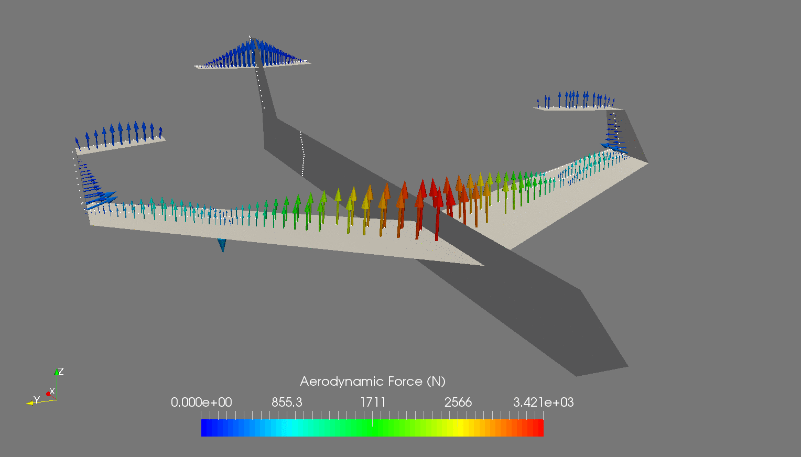

# FLOWVLM

Vortex lattice method developed by Eduardo Alvarez (Edo.AlvarezR@gmail.com), August 2017.

FUNCTIONALITY
-Arbitrary 3D lifting surface geometries.
-Arbitrary freestream definition.
-Sideslip.
-Interaction of multiple lifting surfaces.

Under GNU Affero General Public License v3.0.
