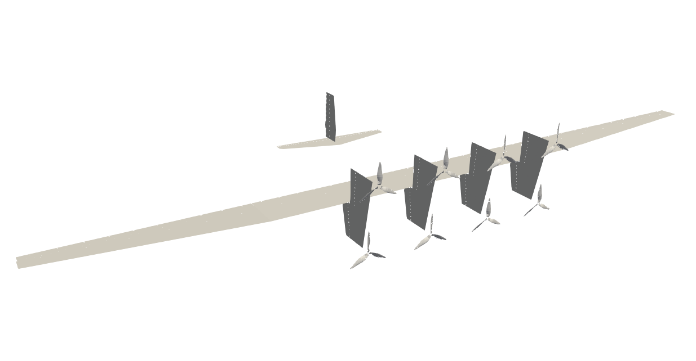
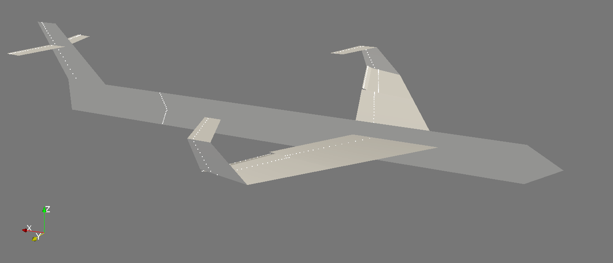
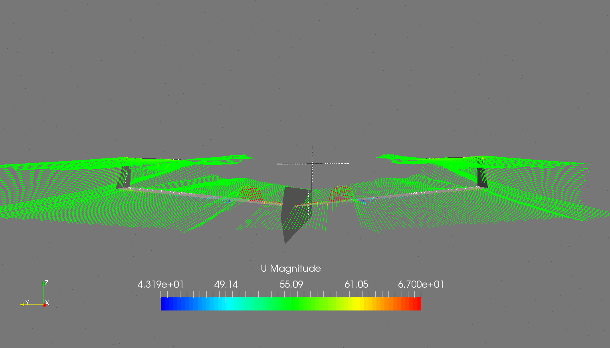
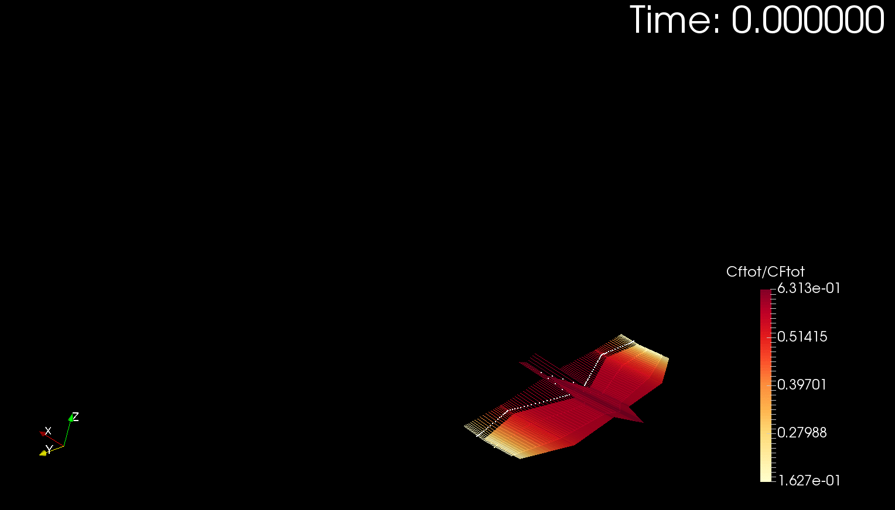

# FLOWVLM

Vortex lattice method developed by Eduardo Alvarez
(Edo.AlvarezR@gmail.com) at the FLOW Lab. August 2017, Brigham Young University.
Written in Julia 0.6.4.

## FUNCTIONALITY
- Arbitrary 3D lifting surface geometries.
- Arbitrary freestream definition.
- Sideslip.
- Interaction of multiple lifting surfaces.

For documentation, examples, and validation, see notebooks in `docs/`.

## License
Under GNU Affero General Public License v3.0.
